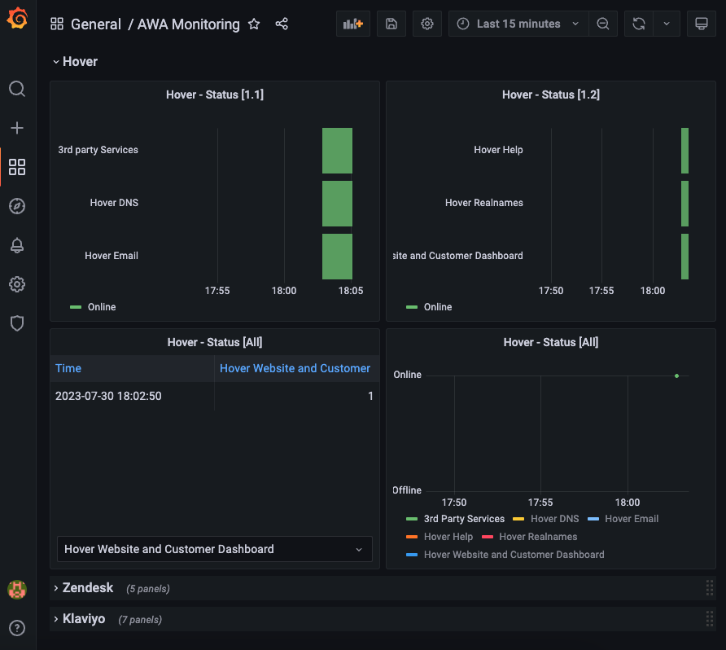

# AWA Monitoring

> A platform monitoring service for the As We Are online store



## [Request a demo](mailto:mhborthwick%20*at*%20gmail%20-dot-%20com)

## Overview

This service provides monitoring of platforms that the As We Are online store (coming soon!) depends on, helping to detect any outages and issues in real-time.

## Requirements

- go 1.20

- Docker

## Setup

- Create `.env` file

- Add the following to `.env` file

```sh
DOCKER_INFLUXDB_ENDPOINT=localhost
DOCKER_INFLUXDB_INIT_MODE=setup
DOCKER_INFLUXDB_INIT_USERNAME=change_me
DOCKER_INFLUXDB_INIT_PASSWORD=change_me # min 8 characters
DOCKER_INFLUXDB_INIT_ADMIN_TOKEN=change_me # openssl rand -hex 32
DOCKER_INFLUXDB_INIT_ORG=change_me # org name
DOCKER_INFLUXDB_INIT_BUCKET=change_me # bucket name
DOCKER_INFLUXDB_INIT_RETENTION=change_me # ex. 4d
DOCKER_INFLUXDB_INIT_PORT=8086
DOCKER_INFLUXDB_INIT_HOST=influxdb
GRAFANA_PORT=3000
```

- Run Docker containers

```sh
$ make up
```

## Start

```sh
$ make run
```

## Supported Platforms

Monitoring is supported for the following platforms:

- [Zendesk - Customer Support](https://status.zendesk.com/)

- [Klaviyo - Email Marketing](https://status.klaviyo.com/)

- [Hover - Domain Hosting](https://hoverstatus.com/)
